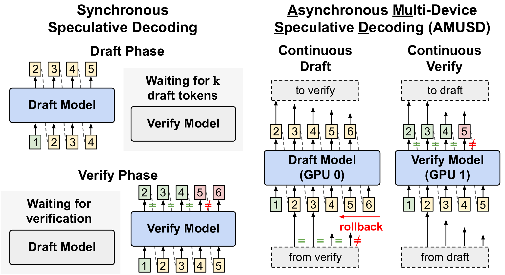

# AMUSD: Asynchronous Multi-Device Speculative Decoding for LLM Acceleration

This repository contains the implementation and evaluation code for AMUSD (Asynchronous Multi-device Speculative Decoding), a novel system for accelerating large language model inference. AMUSD decouples the draft and verify phases of speculative decoding into continuous, asynchronous operations across multiple devices (e.g., GPUs), achieving significant performance improvements over alternating draft and verify phases in conventional speculative decoding.



## Benchmark Results

| Benchmark   | Method        | Mean Token Time (↓) | Speedup (↑) |
|-------------|---------------|---------------------|-------------|
| HumanEval   | Autoregressive| 22.15 ms/token      | 1.00×       |
|             | Speculative   | 17.88 ms/token      | 1.24×       |
|             | AMUSD (ours)  | 14.08 ms/token      | 1.57×       |
| MT-Bench    | Autoregressive| 21.89 ms/token      | 1.00×       |
|             | Speculative   | 20.64 ms/token      | 1.06×       |
|             | AMUSD (ours)  | 16.75 ms/token      | 1.31×       |
| RefactorChat| Autoregressive| 27.42 ms/token      | 1.00×       |
|             | Speculative   | 19.18 ms/token      | 1.43×       |
|             | AMUSD (ours)  | 13.96 ms/token      | 1.96×       |

AMUSD consistently outperforms both autoregressive and conventional speculative decoding across various benchmarks, achieving up to 1.96× speedup without compromising output quality.


## Usage

To run a simple example of AMUSD:

```bash
python run_example.py --dataset BradMcDanel/refactorchat --sample-index 0 --strategy amusd
```

To benchmark AMUSD against other decoding methods:

```bash
python benchmark.py --draft-model-path meta-llama/Llama-3.2-1B-Instruct --verify-model-path meta-llama/Llama-3.1-8B-Instruct --dataset BradMcDanel/RefactorChat --num-samples 2 --output-file results/refactorchat.json --strategies greedy sd amusd
```

## Reproducing Results

Benchmark results are stored in the `results/` directory. You can analyze these results using the `print_benchmark_stats.py` script:

```bash
python print_benchmark_stats.py results/<benchmark_result_file>.json
```

Check the `viz/` directory for scripts to generate visualizations of the benchmark results.


## Citation

If you use AMUSD in your research, please cite our paper:

```
@misc{mcdanel2024amusdasynchronousmultidevicespeculative,
      title={AMUSD: Asynchronous Multi-Device Speculative Decoding for LLM Acceleration}, 
      author={Bradley McDanel},
      year={2024},
      eprint={2410.17375},
      archivePrefix={arXiv},
      primaryClass={cs.CL},
      url={https://arxiv.org/abs/2410.17375}, 
}
```

## License

[MIT License](LICENSE)

## Contact

For any questions or issues, please open an issue on this repository or contact Bradley McDanel at bmcdanel@fandm.edu.
